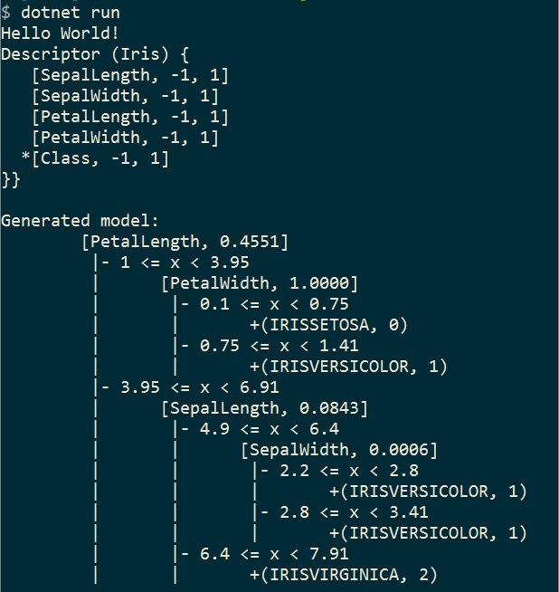

# Getting Started

The newest version of numl is designed to work on the .NET platform 
(as much as we could reach). This tutorial is designed to get you started
on (hopefully) any platform. This is all CLI based.

## Installing .NET Core

[Installing .NET Core](http://dotnet.github.io/getting-started/) should 
not be too difficult if you follow the instructions outlined on the 
[Getting Started](http://dotnet.github.io/getting-started/) page. 
There are several links for installing the bits depending on your OS.

## Initializing a Project

1. Create a folder for your project
2. cd into it and `dotnet new console` - this will create a basic
   console application
3. Next we will add `numl` (and its dependencies) to the project
   via NuGet. Run `dotnet add package numl -v 0.9.9-*`. This modifies
   the `.csproj` project file as follows:

```xml
<Project Sdk="Microsoft.NET.Sdk">
  <PropertyGroup>
    <OutputType>Exe</OutputType>
    <TargetFramework>netcoreapp1.1</TargetFramework>
  </PropertyGroup>
  <ItemGroup>
    <PackageReference Include="numl" Version="0.9.9-*" />
  </ItemGroup>
</Project>```

These were the lines added:

```xml
  <ItemGroup>
    <PackageReference Include="numl" Version="0.9.9-*">
  </ItemGroup>
```

If you are using Visual Studio Code and edit the project file manually,
it will ask you to update the dependencies.
   
# Writing Some Code

Add the sample [Iris.cs](..\data\Iris.zip) code to your project folder. I added some
code to my `Program.cs` file to test things out (it ended up looking like this):

```csharp
using System;
using numl.Model;
using numl.Supervised.DecisionTree;

namespace ConsoleApplication
{
    public class Program
    {
        public static void Main(string[] args)
        {
            Console.WriteLine("Hello World!");
            var description = Descriptor.Create<Iris>();
            Console.WriteLine(description);
            var generator = new DecisionTreeGenerator();
            var data = Iris.Load();
            var model = generator.Generate(description, data);
            Console.WriteLine("Generated model:");
            Console.WriteLine(model);
        }
    }
}
```

# Running the code

1. Run `dotnet restore` if you've made further changes to the `.csproj` file
2. Run `dotnet run`



